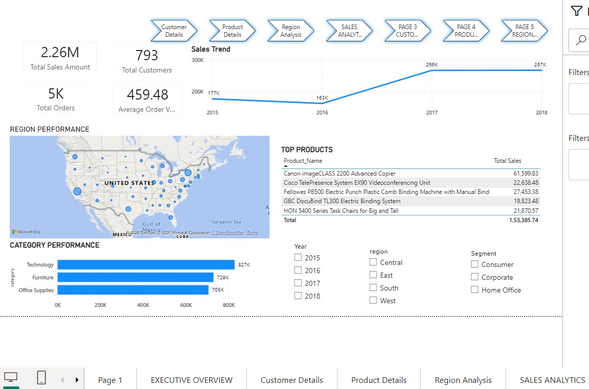
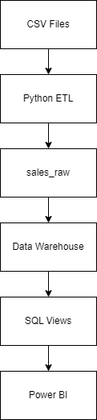
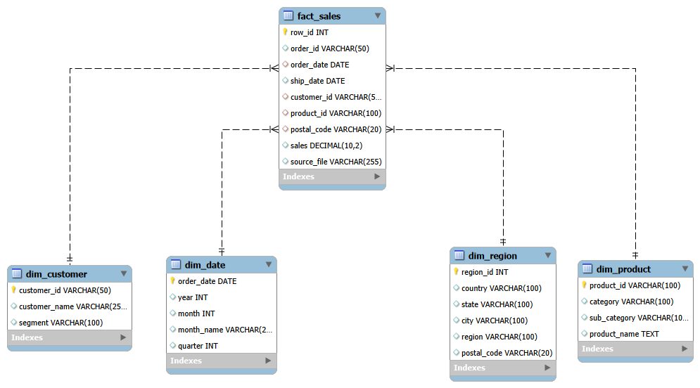
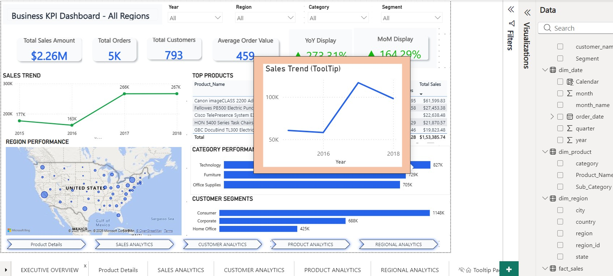
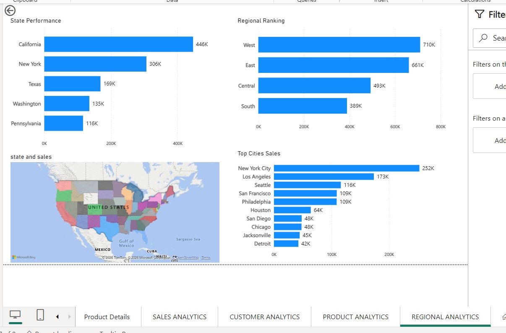
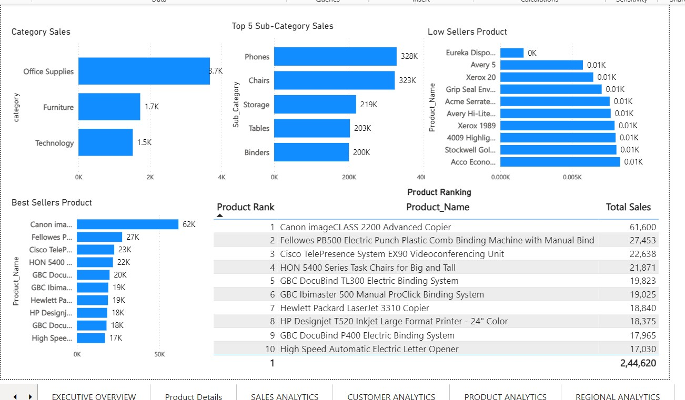
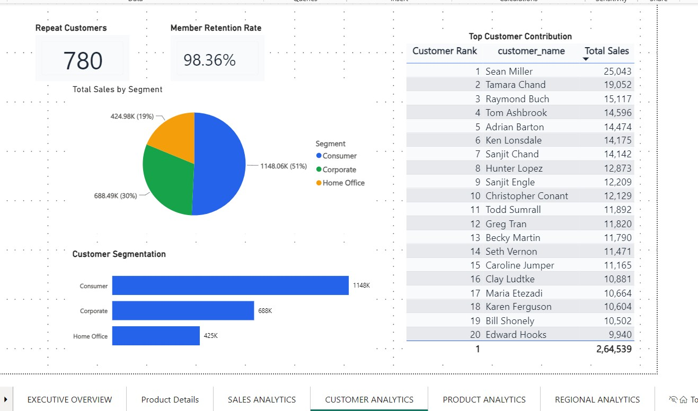

# Dashboard Preview


# 🚀 Business KPI Dashboard | Production ETL Pipeline + Data Warehouse + Power BI

A production-style **Data Engineering and Business Intelligence project** that automates data ingestion, transformation, warehousing, and visualization using **Python, MySQL, SQL, and Power BI**.

The solution demonstrates an end-to-end analytics workflow, from raw CSV files to executive-level dashboards, following modern data engineering best practices.

---

# 📌 Project Highlights

* ✅ Automated ETL Pipeline built with Python
* ✅ Incremental Data Loading using ETL Control Table
* ✅ Production Logging with Loguru
* ✅ Star Schema Data Warehouse Design
* ✅ SQL-Based KPI Layer
* ✅ Interactive Power BI Dashboard
* ✅ Automated File Archival & Error Handling
* ✅ Scalable Architecture for Business Reporting

---

# 🏗️ Solution Architecture


```
                Raw CSV Files
                      │
                      ▼
          Python ETL Pipeline
      (Pandas + SQLAlchemy + Loguru)
                      │
                      ▼
             Staging Layer (sales_raw)
                      │
                      ▼
          MySQL Data Warehouse
      ┌─────────────────────────────┐
      │         fact_sales          │
      │         dim_customer        │
      │         dim_product         │
      │         dim_region          │
      │         dim_date            │
      └─────────────────────────────┘
                      │
                      ▼
          SQL Views & KPI Queries
                      │
                      ▼
           Power BI Interactive Dashboard
```

---

# ⚙️ Technology Stack

| Category        | Technology             |
| --------------- | ---------------------- |
| Programming     | Python                 |
| Data Processing | Pandas                 |
| Database        | MySQL                  |
| ORM             | SQLAlchemy             |
| Logging         | Loguru                 |
| Environment     | python-dotenv          |
| BI Tool         | Power BI               |
| Scheduling      | Windows Task Scheduler |
| Version Control | Git & GitHub           |

---

# 📂 Project Structure

```
Business-KPI-Dashboard-Pro/
│
├── assets/
│   ├── architecture.png
│   ├── schema.png
│   ├── dashboard_overview.png
│   ├── dashboard_page2.png
│   └── dashboard_page3.png
│
├── config/
│
├── data/
│   ├── raw/
│   ├── archive/
│   └── failed/
│
├── sample_data/
│   └── sample_sales.csv
│
├── logs/
│
├── powerbi/
│   └── Business_KPI_Dashboard.pbix
│
├── scripts/
│   └── etl_pipeline.py
│
├── sql/
│   ├── schema.sql
│   ├── warehouse.sql
│   ├── views.sql
│   └── kpi_queries.sql
│
├── requirements.txt
├── LICENSE
├── README.md
└── .gitignore
```

---

# 🚀 ETL Pipeline Workflow

The ETL process performs the following operations automatically:

### 1. Detect CSV Files

Scans the `data/raw` folder for incoming datasets.

---

### 2. Read Data

Loads CSV files using Pandas.

---

### 3. Data Cleaning

* Standardizes column names
* Removes unwanted spaces
* Converts text to lowercase
* Handles invalid dates

---

### 4. Incremental Loading

Reads the `etl_control` table and only loads records with new `row_id` values.

This prevents duplicate loading.

---

### 5. Stage Data

Loads cleaned data into:

```
sales_raw
```

---

### 6. Populate Dimension Tables

Automatically loads:

* dim_customer
* dim_product
* dim_region
* dim_date

using deduplication logic.

---

### 7. Populate Fact Table

Loads transactional sales data into:

```
fact_sales
```

while preventing duplicate records.

---

### 8. Update ETL Control

Updates:

```
last_loaded_row_id
last_run
```

for future incremental executions.

---

### 9. Archive Files

Successfully processed files are moved to:

```
data/archive/
```

---

### 10. Error Handling

Failed files are automatically moved to:

```
data/failed/
```

and detailed logs are generated.

---

# ⭐ Data Warehouse Design

The project follows a **Star Schema** architecture.

## Fact Table

```
fact_sales
```

Contains transactional sales records.

## Dimension Tables

```
dim_customer

dim_product

dim_region

dim_date
```

This design improves analytical query performance and simplifies reporting.

---

# Star Schema



---
# 📊 Key Business KPIs

The dashboard includes:

* Total Sales
* Total Orders
* Total Customers
* Average Order Value
* Monthly Sales Trend
* Year-over-Year Growth
* Month-over-Month Growth
* Top Products
* Top Categories
* Top Regions
* Customer Segmentation
* Sales Contribution %
* Repeat Customers
* Shipping Delay Analysis
* Dynamic Ranking
* Revenue Distribution

---

# 📈 Power BI Features

The Power BI report provides:

* Executive KPI Cards
* Dynamic Titles
* Bookmarks
* Drillthrough
* Custom Tooltips
* Conditional Formatting
* Top N Analysis
* Customer Segmentation
* YoY Growth
* MoM Growth
* Repeat Customers
* Contribution %
* Shipping Delay Analysis
* Interactive Filters

---

# 📝 Logging & Monitoring

The ETL pipeline uses **Loguru** for production logging.

Logs include:

* Pipeline start
* File detection
* Processing status
* Record counts
* Errors
* Successful loads
* Archive actions

Example:

```
Pipeline Started

Files Found: 1

9800 rows loaded into sales_raw

fact_sales loaded

ETL Control Updated

sales.csv archived

Pipeline Completed
```

---

# ▶️ Running the Project

## Clone Repository

```bash
git clone <repository-url>
```

---

## Install Dependencies

```bash
pip install -r requirements.txt
```

---

## Configure Environment Variables

Create a `.env` file:

```env
MYSQL_USER=root
MYSQL_PASSWORD=your_password
MYSQL_HOST=localhost
MYSQL_DATABASE=business_kpi_dw
```

---

## Execute ETL Pipeline

```bash
python scripts/etl_pipeline.py
```

---

## Open Power BI Dashboard

Load:

```
powerbi/Business_KPI_Dashboard.pbix
```

and refresh the MySQL connection.

---

# Project Metrics

9800+ Sales Records

628 Region Records

793 Product Records

999 Customer Records

479 Calendar Dates

5 Dimension Tables

1 Fact Table

15+ KPIs

25+ DAX Measures

Production ETL Pipeline

---

# 🎯 Business Value

This solution demonstrates how organizations can:

* Automate manual reporting
* Reduce repetitive ETL effort
* Maintain a centralized data warehouse
* Enable near real-time analytics
* Improve executive decision-making
* Monitor KPIs through interactive dashboards

---

# Key Learnings

• Incremental ETL Design
• Data Warehousing
• Star Schema Modeling
• Slowly Changing Dimensions
• SQL Optimization
• Production Logging
• Error Handling
• Data Cleaning
• Power BI DAX
• Time Intelligence
• Business KPI Development

---

# 🚀 Future Enhancements

* Docker
* Apache Airflow
* Azure Data Factory
* Snowflake
* AWS S3
* dbt
* CI/CD
* GitHub Actions
* Row Level Security
* Fabric

---

# assets/





## Executive Overview


## Product Analysis



## Customer Analysis


-----

# 👨‍💻 Author

**Shashikant Dubey**

Data Analyst | Data Engineer | Business Intelligence Enthusiast

Specializing in Python, SQL, MySQL, ETL Pipelines, Power BI, Data Warehousing, and Analytics Engineering.
